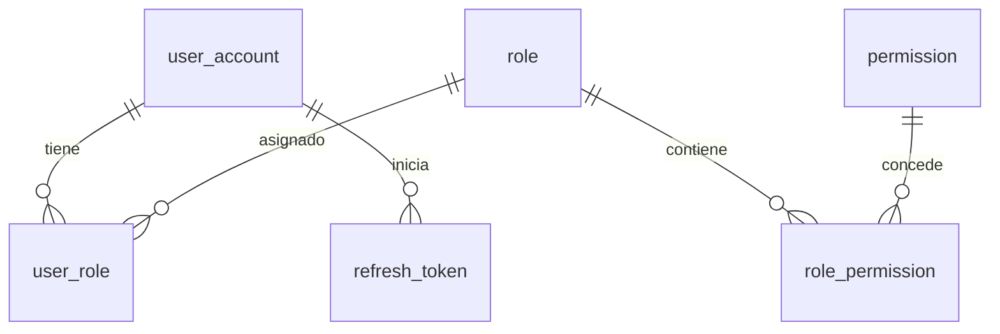

# Modelo lógico IAM

Usuario N:M Rol N:M Permiso. Usuario 1:N RefreshToken; los tokens pertenecen a una familia que se revoca al detectar reutilización. La rotación conserva la antigüedad de MFA. Usuario conserva el secreto cifrado, confirmación de enrolamiento y último paso TOTP usado. Los cambios de usuario/RBAC generan Outbox en la misma transacción.

Redis mantiene desafíos temporales de autenticación y límites de intentos; no sustituye la autoridad de PostgreSQL. No hay FK fuera de iam.

Outbox referencia agregados mediante aggregate_type/aggregate_id y publica eventos versionados. Sus identificadores no crean FK entre servicios.
